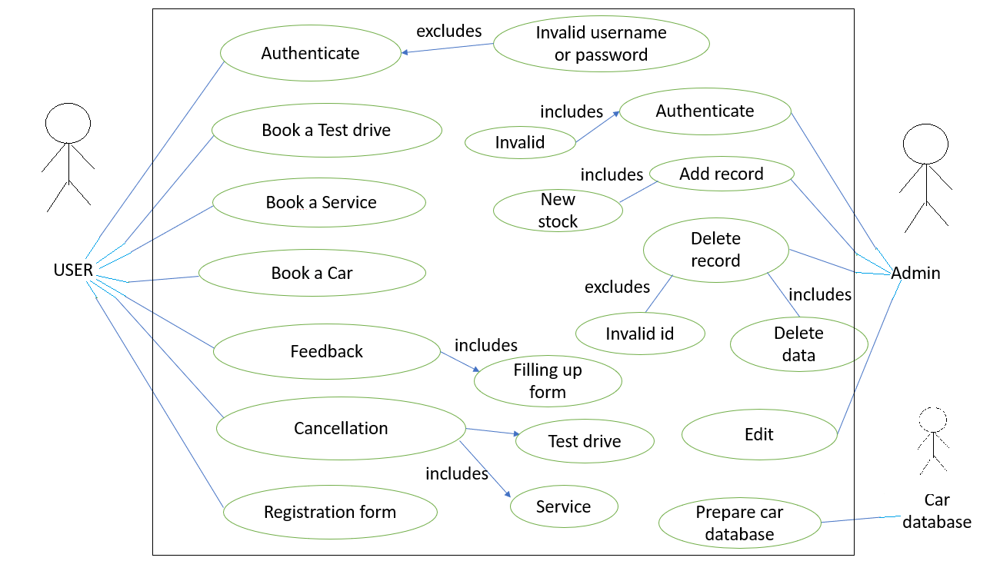
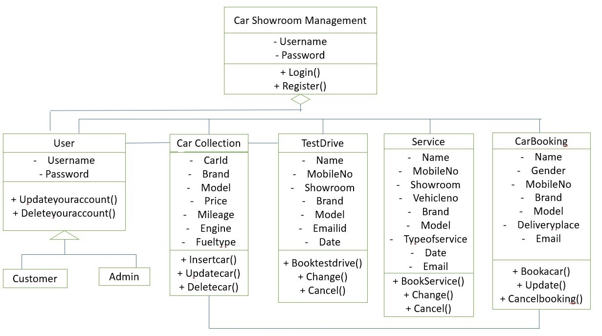
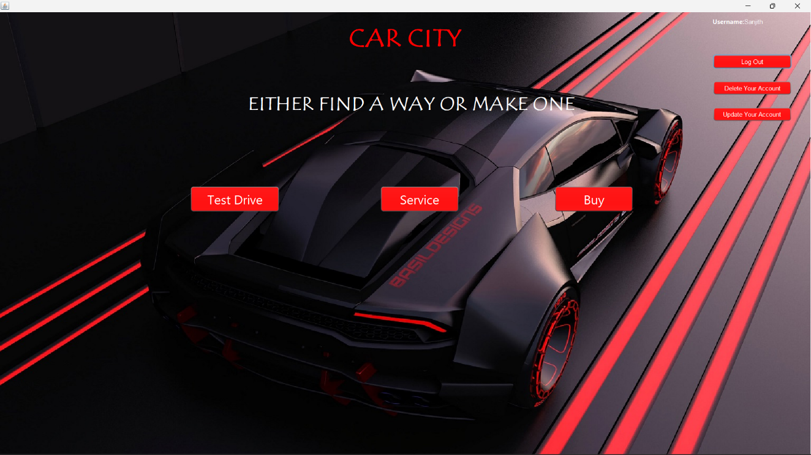
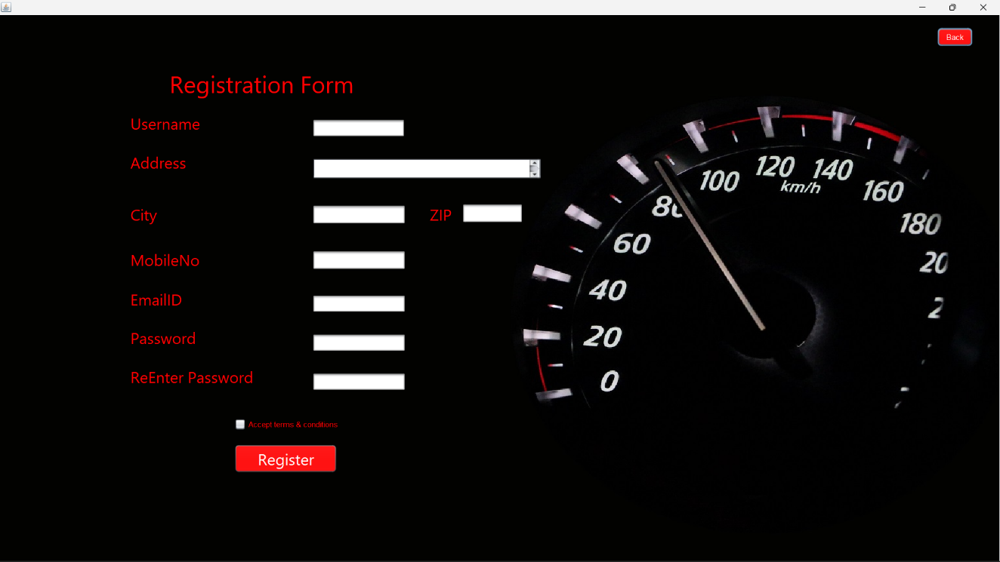
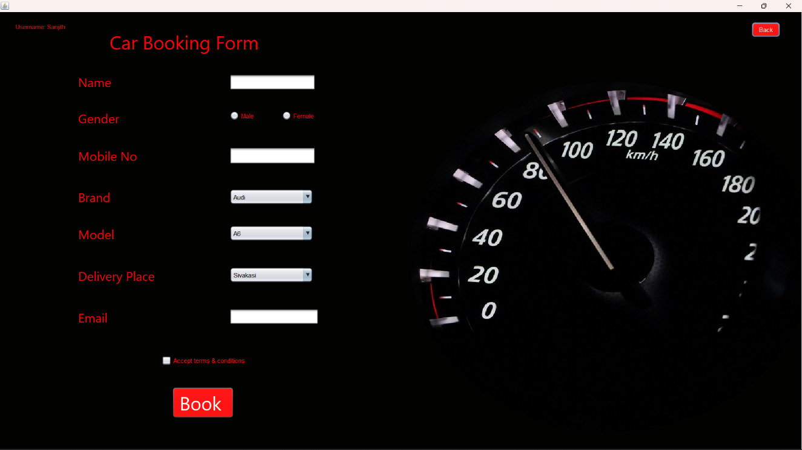
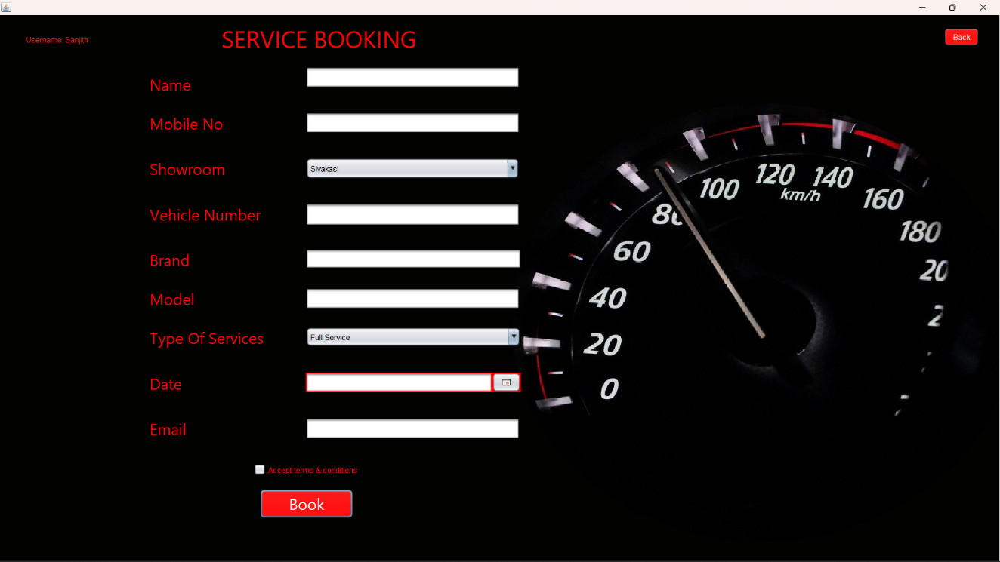
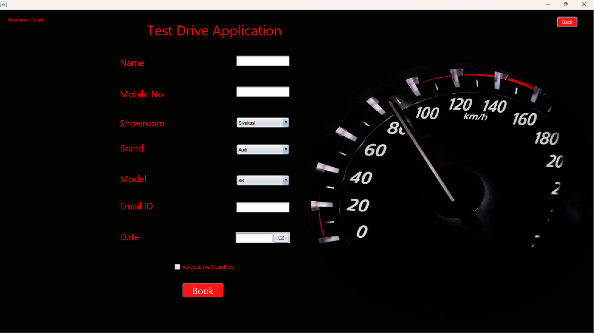
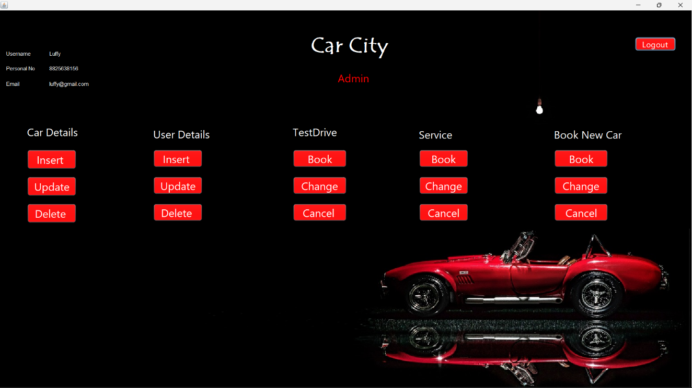

# Car-Showroom-Management-System-Oracle-Edition

The Car Showroom Management System provides an desktop application for customers to browse and purchase cars, schedule test drives, and book services. Administrators can manage inventory, bookings, and user accounts with ease through a user-friendly interface.

## Table of Contents

1. Introduction
2. Objectives
3. Scope
4. Features
5. System Requirements
6. Installation
7. Database Setup
8. Usage
9. Diagrams
10. Sample Output

---

### 1. Introduction

The purpose of the Car Showroom Management System is to streamline car sales and management. It provides options for customers to buy cars using desktop application, schedule test drives, and access services. The system is also efficient for showroom administrators to manage data and update reports.

### 2. Objectives

The primary goal of this system is to manage the car sales process and update showroom data efficiently. The system provides detailed reporting for showroom administrators on product availability.

### 3. Scope

This project simplifies car sales by offering a range of vehicles, scheduling test drives, and providing various services for customers. Proper registration is required for access.

### 4. Features

- **User Authentication**: Secure login for customers and admins.
- **Car Inventory Management**: Admins can manage car details.
- **Test Drive and Service Bookings**: Customers can schedule and book online.
- **Admin Dashboard**: Access to reports and data management.
- **Navigation Assistance**: Maps from the user’s location to the showroom.

### 5. System Requirements

- **Hardware**: Core i5 processor, 4 GB RAM, CPU 2.50 GHz.
- **Software**:
    - **Operating System**: Any
    - **Database**: Oracle Database (instead of MySQL in XAMPP)
    - **IDE**: NetBeans for Java development
    - **Java**: Version 8 or above
    - **Oracle JDBC Driver**: Oracle's JDBC driver for Java database connectivity

### 6. Installation

1. **Install Dependencies**: Make sure Java, NetBeans, and Oracle Database are installed.
2. **Set Up Oracle Database**: Start Oracle Database and ensure the necessary tables are set up.

### 7. Database Setup

1. **Set Up Oracle Database**:
   - Ensure you have Oracle Database installed and running.
   - Use Oracle SQL Developer or a command-line tool to create a new schema for this project, named `cardb` or similar.

2. **Create Database Tables**:
   - Execute the SQL scripts provided in the `db/` folder within your Oracle Database environment to create necessary tables and populate initial data.
   - Open Oracle SQL Developer, connect to your database, and run the scripts.

3. **Configure Database Connection**:
   - Update the database connection configuration in your Java files to use Oracle’s JDBC connection string. For example:

   ```java
   Connection con = DriverManager.getConnection("jdbc:oracle:thin:@localhost:1521:xe", "username", "password");
   
### 8. Usage

1. **Run Application**: Open the project in NetBeans and run the `Homepage.java`.
2. **Login/Register**: New users must register before logging in. Admins have additional privileges.
3. **Feature Access**:
    - **Customers** can browse, book test drives, schedule services, and buy cars.
    - **Admin** has options for inventory management, bookings, and access to data reports.
  
### 9. Diagrams

### Use Case Diagram



### Class Diagram



### 10. Sample Output














